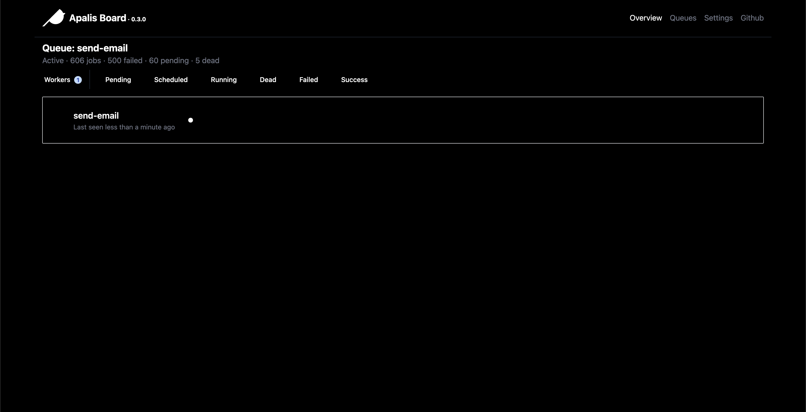
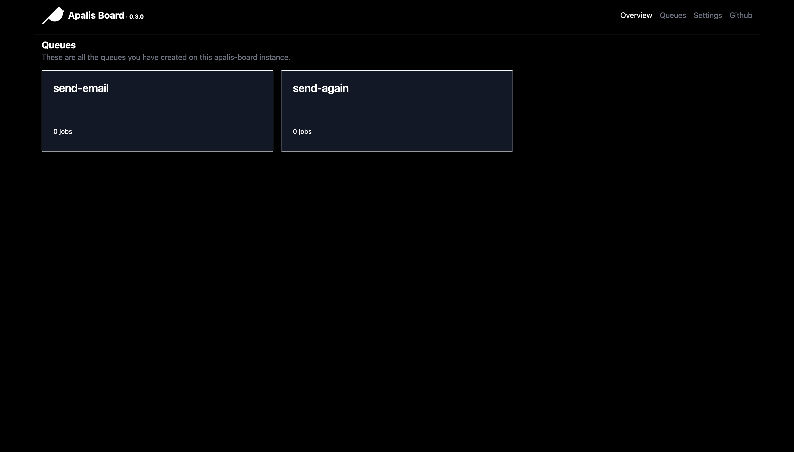
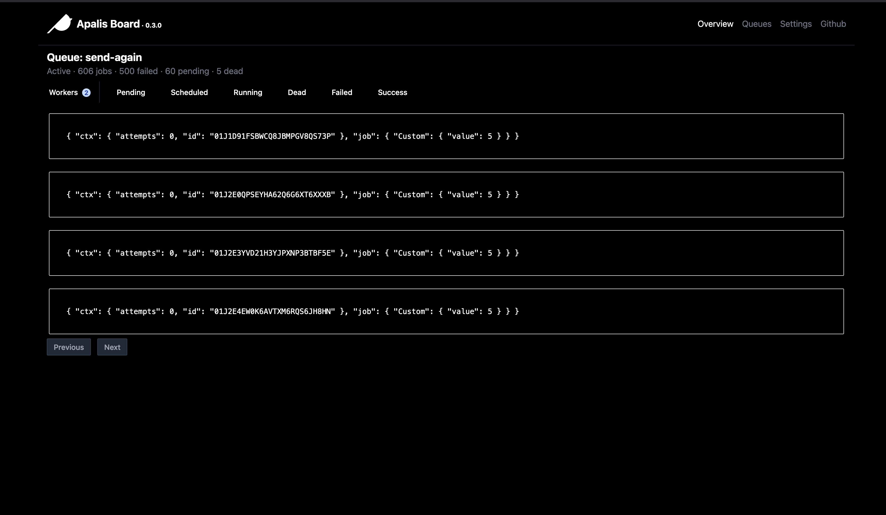

#  apalis-board

Apalis board contains a nummber of creates useful for building UIs for [Apalis](https://github.com/geofmureithi/apalis) abd help you visualize your queues and their jobs.
With this library you get a beautiful UI for visualizing what's happening with each job in your queues, their status and some actions that will enable you to get the job done.

## Screenshots

### Workers


### Queues


### Jobs


## Crates

### Backend

An extensible `actix` service It handles job scheduling, storage, and task execution.

### Chirp

The chirp crate is the main entry point for the `apalis-chirp` command runner. It configures the application, sets up the necessary components, and starts the server.

### Frontend

Contains a reusable frontend build with `hirola`

### Shared

The shared crate contains common code and utilities that are used across the other crates. This includes data models, configuration handling, and utility functions.

## Examples

### Rest API

The `rest-api` example demonstrates how to use `apalis` and `actix` to create an application to run jobs via HTTP requests.


### Building the Workspace

To build the entire workspace, run the following command:

```sh
cargo build --release
```
